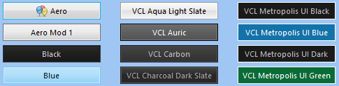

# JPPack 

## Overview

JPPack is a small collection of Delphi VCL components.

These components were created within a few years, they were repeatedly modified, improved, and expanded with the functions needed in the implementation of specific projects. Generally, there is a small chaos, but I think everything works OK (I hope!).

Many of my components, unfortunately, I can not share, because they are modified commercial components from different producers (TMS, BergSoft), and the license prohibits me from publishing the source codes of such modified components.

I am no expert on writing VCL components and helped myself by analyzing the source codes (and using fragments) of various free Delphi components, especially **Cindy Components** (https://sourceforge.net/projects/tcycomponents/) and **PngComponents** (https://bitbucket.org/uweraabe/pngcomponents).

## Components

### TJppPanel

A highly customizable panel (`TCustoPanel` descendant) with several additions. It was written on the basis of one of the panels included in the *Cindy Components* package (but I do not remember exactly which one).  

Additional properties: 
1. **Upper and bottom part** filled with a gradient (or solid color).  
The panel is divided into two parts - upper and lower. For each of them you can define colors separately. The size of the upper part (relative to the lower) can also be modified (property `Appearance.UpperGradientPercent`). For example, you can set the upper gradient size to 30%, then the bottom will automatically take up the rest of the panel surface (70%). You can also completely eliminate the bottom gradient by setting the `UpperGradientPercent` property to 100%.  
If you need to fill the upper part with a gradient and the bottom one with a solid color, set the desired gradient colors of the upper part, then set the same starting and ending color of the gradient in the lower part.  
If you do not want to use a gradient, you can easily turn it off by setting the `Appearance.DrawGradient` property to `False`, then the `Appearance.BackgroundColor` color will be used to fill the panel background with a solid color.

1. **Borders**.  
You can set the thickness, color, style and visibility of the panel borders. Each border is configured separately. For example, you can set the upper edge with a pen width = 10 in red, the lower edge in green and a pen width = 2, and hide the left and right edges completely. You have a full control.  
If you do not want to display borders at all, set `Appearance.DrawBorder` to `False`.

1. Unlimited collections of **horizontal lines**, **vertical lines**, **captions** and **horizontal bars**.  
Each line (vertical and horizontal) is also configured separately and can be set here all standard parameters for the lines - the color, weight, style. The lines can be positioned relative to the edges of the panel or centered.  
The standard panel has only one **caption**, which is always centered and can not be changed. `TJppPanel` can contain any number of captions. They can be centered or positioned relative to the corners of the panel. Moreover, each caption has its own font (`TFont`) and you can freely set font styles, size and color for each caption separately.  
The **horizontal bars** are simply rectangles, the size and position of which you can freely set. In addition, you can set the color, thickness and style of the rectangle's borders. Finally, each rectangle can be filled with a solid color or gradient.

### TJppPngButton

`TJppPngButton` is a much extended `TPngBitBtn` button from the **PngComponents** package.  

The button can be in one of **five states**: *normal*, *hot*, *down* (pressed), *focused* and *disabled*. For each state you can set a whole range of display parameters: upper and bottom gradient/solid color (similarly to `TJppPanel`), border color, style and width. You can also turn off drawing border and/or background (`Appearance.<STATE>.TransparentFrame` / `Appearance.<STATE>.TransparentBackground`).

The visibility of the button **caption** can be quickly changed using the `Appearance.ShowCaption` property.  
If you do not want to display the **focus rectangle** on the active button, set property `Appearance.FocusRect` to `frtNone`.  
If you want the button to be displayed in system colors, set property `Appearance.DefaultDrawing` to `True` (all custom colors defined in the `Appearance` will then be ignored).

#### TJppPngButton - Color maps (Color schemes)

The number of all colors for all button states is really big, so I decided to make it easier to manage the displayed colors using ready-to-use color schemes (color maps).

I have created 37 different color schemes for `TJppPngButton`. To change the active color scheme, select one of the schemes available in the `ColorMapType` property in the *Object Inspector*. Of course, you can also change the color scheme in the code at runtime.

Over half of the color schemes I have prepared are schemes that mimic the **VCL styles** available from the **XE2** version of the Delphi environment. All such schemes begin with the prefix `cmtVcl`. Of course, these *VCL color schemes* work even if you do not enable VCL support in your program at all. You can also, for example, turn on the `Charcoal Dark Slate` VCL style for the application, and `cmtVclCarbon` for the `TJppPngButtons`. There is absolutely no problem.

#### TJppPngButton Color Maps Designer
All color schemes I have prepared in the `TJppPngButton Color Maps Designer` program, which is located in the repository in the demos directory.

## Installation

